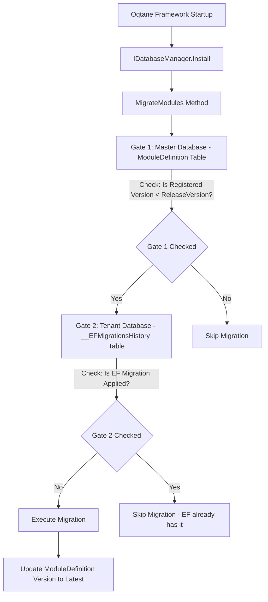
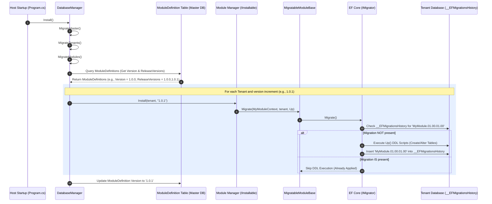

# 12 - Database Migrations: Startup Execution, Versioning, and Multi-Database Safety

Database migrations in Oqtane are fundamentally different from standard Entity Framework Core usage.

Many issues in Oqtane modules stem from assuming standard EF Core migration behavior, especially when AI tools or developers generate code based on generic .NET patterns. In Oqtane, database migrations are treated as a "voodoo" black box. This guide demystifies the entire migration lifecycle, explaining exactly how the framework discovers and executes database changes, and provides a step-by-step playbook to get module migrations to run again when they fail or get stuck.

---

## The Dual-Gated Architecture (Mental Model)

To understand Oqtane module migrations, you must understand that the framework uses a **dual-gated tracking system**. A migration will only run if both gates are synchronized.

### Gate 1: Framework Metadata (Master Database)
The Oqtane Master database contains a `ModuleDefinition` table. Every module definition has two key columns:
- **`Version`**: The currently registered version of the module installed on this instance (e.g., `1.0.0`).
- **`ReleaseVersions`**: A comma-separated list of all versions of the module that have migrations (e.g., `1.0.0,1.0.1,2.0.0`). This is populated from the module's assembly attributes or manifest.

Oqtane uses Gate 1 to determine *which* versions are missing. If the registered `Version` is `1.0.1` and the `ReleaseVersions` string is `1.0.0,1.0.1`, Oqtane assumes the database schema is up-to-date and will **not** attempt to run any migrations, even if the database tables do not actually exist!

### Gate 2: Database Schema (Tenant Database)
The target Tenant database contains the standard EF Core tracking table: `__EFMigrationsHistory`.
- For each executed EF Core migration class (e.g., `Oqtane.Modules.HtmlText.Migrations.InitializeModule` decorated with `[Migration("HtmlText.01.00.00.00")]`), a record is inserted into this table.
- Oqtane uses Gate 2 to track the actual physical schema state. If EF Core's `IMigrator` runs and finds that a specific migration ID already exists in `__EFMigrationsHistory`, it skips executing that specific class.

---

## Visual Flow Diagrams

### Dual-Gate Logical Flow
The following flowchart illustrates the decision-making process Oqtane undergoes for each module definition at startup:



### Detailed Sequence Diagram
The diagram below traces the interaction sequence of classes and database tables during a successful module migration:



---

## Detailed Step-by-Step Execution Flow

Every time the Oqtane application starts up, the following execution chain occurs to apply module migrations:

### 1. Framework Initialization (`Program.cs`)
At startup, in `Program.Main`, the application retrieves `IDatabaseManager` from the DI container and calls:
```csharp
var databaseManager = app.Services.GetService<IDatabaseManager>();
var install = databaseManager.Install();
```

### 2. The Installation/Upgrade Sequence (`DatabaseManager.cs`)
Inside `DatabaseManager.Install(InstallConfig install)`, Oqtane processes database actions in a strict sequence:
1. `CreateDatabase(install)` - Creates the DB if it does not exist.
2. `MigrateMaster(install)` - Applies EF Core migrations to the Master database.
3. `CreateTenant(install)` - Prepares alias/tenant mappings.
4. `MigrateTenants(install)` - Applies framework tenant-level EF Core migrations.
5. `MigrateModules(install)` - **This is where module migrations run!**
6. `CreateSite(install)` - Configures default site settings.

### 3. Module Migration Selection (`DatabaseManager.MigrateModules`)
Inside `MigrateModules`, Oqtane loops through all registered module definitions:
```csharp
foreach (var moduleDefinition in moduleDefinitions.GetModuleDefinitions())
{
    if (!string.IsNullOrEmpty(moduleDefinition.ReleaseVersions))
    {
        var versions = moduleDefinition.ReleaseVersions.Split(',', StringSplitOptions.RemoveEmptyEntries);
        // ...
```
For each module definition, Oqtane checks its registered version in the master database (`moduleDefinition.Version`) and parses its `ServerManagerType` (the namespace-qualified manager class, e.g., `Oqtane.Modules.HtmlText.Manager.HtmlTextManager, Oqtane.Server`).

For each tenant in the system, Oqtane resolves the version difference:
- It checks if the database's version of the module is older than the latest version listed in `ReleaseVersions`.
- If a version mismatch is found, it determines which version increments must be executed (e.g., if database is `1.0.0` and latest is `1.0.2`, it needs to run migrations for `1.0.1` and `1.0.2`).

### 4. Executing the Migrations
For each version increment, Oqtane checks the capability of the module manager class:

#### Case A: Module manager implements `IInstallable` (Standard EF Core Migrations)
Oqtane sets the active tenant context using `ITenantManager.SetTenant` and instantiates the manager class via dependency injection:
```csharp
tenantManager.SetTenant(tenant.TenantId);
var moduleObject = ActivatorUtilities.CreateInstance(scope.ServiceProvider, moduleType) as IInstallable;
```
It then calls the `Install` method of the manager, passing in the target tenant and the specific version increment:
```csharp
moduleObject.Install(tenant, version);
```
Inside the `Install` method, the module developer invokes the inherited `Migrate` method from `MigratableModuleBase`:
```csharp
public bool Install(Tenant tenant, string version)
{
    return Migrate(new MyModuleContext(_DBContextDependencies), tenant, MigrationType.Up);
}
```
This, in turn, retrieves the EF Core `IMigrator` service for the module's custom `DbContext` and executes it:
```csharp
var migrator = dbContext.GetService<IMigrator>();
migrator.Migrate();
```
EF Core scans the assembly for classes decorated with `[DbContext(typeof(MyModuleContext))]`, orders them by their `[Migration]` attribute, checks the tenant database's `__EFMigrationsHistory` table, and runs any pending migration classes.

#### Case B: Module manager does NOT implement `IInstallable` (SQL Script Fallback)
If the manager class does not implement `IInstallable`, Oqtane falls back to searching the manager's assembly for an embedded SQL script resource matching this naming convention:
`[ModuleTypeName].[Version].sql` (e.g., `Oqtane.Modules.HtmlText.1.0.1.sql`).
Oqtane then executes this SQL script directly against the tenant database using the connection string and ADO.NET:
```csharp
sql.ExecuteScript(tenant, moduleType.Assembly, Utilities.GetTypeName(moduleDefinition.ModuleDefinitionName) + "." + versions[i] + ".sql")
```

### 5. Finalizing the Version
Once all migrations for all version increments of a module complete successfully without errors, Oqtane updates the `Version` column of the module's row in the master `ModuleDefinition` table to the latest version in the `ReleaseVersions` list.

---

## Simulated Execution Traces

Reviewing startup logs inside `Oqtane.Server/LogPulse.txt` or standard debug output helps trace migration events. Below are simulations of what developers will encounter:

### Trace 1: Successful Module Migration Applied
```text
[08:00:02 INFO] [Oqtane.Server.Program.Main] Starting Oqtane installation checks...
[08:00:03 INFO] [Oqtane.Infrastructure.DatabaseManager] MigrateModules processing begins.
[08:00:04 DEBUG] [Oqtane.Infrastructure.DatabaseManager] Checking Module: StudioElf.Module.CRM
[08:00:04 DEBUG] [Oqtane.Infrastructure.DatabaseManager] Master Version = 1.0.0, ReleaseVersions = 1.0.0,1.0.1
[08:00:04 INFO] [Oqtane.Infrastructure.DatabaseManager] Version mismatch detected for Tenant: Default. Upgrading StudioElf.Module.CRM from 1.0.0 to 1.0.1
[08:00:04 DEBUG] [Oqtane.Infrastructure.DatabaseManager] Instantiating ServerManagerType: StudioElf.Module.CRM.Manager.CRMManager, StudioElf.Module.CRM.Server
[08:00:05 INFO] [Microsoft.EntityFrameworkCore.Database.Command] Executing DbCommand [Parameters=[], CommandType='Text', CommandTimeout='30']
SELECT 1 FROM [__EFMigrationsHistory] WHERE [MigrationId] = 'StudioElf.Module.CRM.Migrations.Initialize_01000100'
[08:00:05 DEBUG] [Microsoft.EntityFrameworkCore.Migrations] Applying migration 'StudioElf.Module.CRM.Migrations.Initialize_01000100'.
[08:00:05 INFO] [Microsoft.EntityFrameworkCore.Database.Command] Executing DbCommand [Parameters=[], CommandType='Text', CommandTimeout='30']
CREATE TABLE [dbo].[StudioElfCRM] (
    [CRMId] int NOT NULL IDENTITY,
    [ModuleId] int NOT NULL,
    [CustomerName] nvarchar(256) NOT NULL,
    CONSTRAINT [PK_StudioElfCRM] PRIMARY KEY ([CRMId])
);
[08:00:05 INFO] [Microsoft.EntityFrameworkCore.Database.Command] Executing DbCommand [Parameters=[], CommandType='Text', CommandTimeout='30']
INSERT INTO [__EFMigrationsHistory] ([MigrationId], [ProductVersion], [AppliedDate], [AppliedVersion])
VALUES ('StudioElf.Module.CRM.Migrations.Initialize_01000100', '8.0.0', GETDATE(), '6.1.5');
[08:00:05 INFO] [Oqtane.Infrastructure.DatabaseManager] Successfully upgraded StudioElf.Module.CRM to version 1.0.1
```

### Trace 2: Migration Bypassed (Skipped)
```text
[08:00:03 INFO] [Oqtane.Infrastructure.DatabaseManager] MigrateModules processing begins.
[08:00:04 DEBUG] [Oqtane.Infrastructure.DatabaseManager] Checking Module: StudioElf.Module.CRM
[08:00:04 DEBUG] [Oqtane.Infrastructure.DatabaseManager] Master Version = 1.0.1, ReleaseVersions = 1.0.0,1.0.1
[08:00:04 DEBUG] [Oqtane.Infrastructure.DatabaseManager] StudioElf.Module.CRM is up-to-date at version 1.0.1. Skipping.
```

### Trace 3: Migration Fails (Crashes Startup)
```text
[08:00:04 INFO] [Oqtane.Infrastructure.DatabaseManager] Version mismatch detected for Tenant: Default. Upgrading StudioElf.Module.CRM from 1.0.0 to 1.0.1
[08:00:05 DEBUG] [Microsoft.EntityFrameworkCore.Migrations] Applying migration 'StudioElf.Module.CRM.Migrations.Initialize_01000100'.
[08:00:05 ERROR] [Microsoft.EntityFrameworkCore.Database.Command] Failed executing DbCommand [Parameters=[], CommandType='Text', CommandTimeout='30']
CREATE TABLE [dbo].[StudioElfCRM] ( ... )
Microsoft.Data.SqlClient.SqlException (0x80131904): There is already an object named 'StudioElfCRM' in the database.
   at Microsoft.Data.SqlClient.SqlConnection.OnError(SqlException exception, Boolean breakConnection, Action`1 triggerQueue)
   ...
[08:00:05 ERROR] [Oqtane.Infrastructure.DatabaseManager] An Error Occurred Installing StudioElf.Module.CRM Version 1.0.1 On Tenant Default - Microsoft.Data.SqlClient.SqlException: There is already an object named 'StudioElfCRM' in the database.
[08:00:05 ERROR] [Oqtane.Server.Program.Main] [Oqtane.Server.Program.Main] Database installation failed. See logs for details.
```

---

## Why Module Migrations Fail (Failure Analysis Matrix)

When a developer changes their schema, compiles, and restarts Oqtane, they are often surprised to find their changes did not apply, or the application crashed on startup. The following matrix outlines common errors and how to resolve them:

| Error Message / Symptom | Root Cause | Immediate Resolution |
| :--- | :--- | :--- |
| **Silent Fail**: Compilation succeeds, app starts up, but new tables/columns do not exist in the database. No errors are logged. | **State Desynchronization**: The master database `ModuleDefinition` table already lists the module's `Version` as equal to or higher than the current `ReleaseVersions`. Oqtane skipped processing. | Perform the **Reset Playbook** to set the Master `ModuleDefinition.Version` back to a lower version. |
| `SqlException (0x80131904): There is already an object named 'TableName' in the database.` | **Schema Contamination**: The database already contains the physical table (perhaps from a manual schema design session), but the `__EFMigrationsHistory` table has no record of this migration, forcing EF Core to try and create it again. | Check if the table has data. If safe, drop the table manually, then ensure `__EFMigrationsHistory` and `ModuleDefinition.Version` are correctly reset. |
| `SqlException (0x80131904): Column name 'ColumnName' already exists in table 'TableName'.` | **Partial Schema Update**: A previous migration run failed half-way, or a column was manually added, but no matching entry was recorded in `__EFMigrationsHistory`. | Roll back or drop the offending column, clear the history, and restart Kestrel to re-run. |
| `InvalidOperationException: The MigrationAssembly does not contain any migrations associated with DbContext 'YourContext'.` | **Missing Context Attribute**: Your migration class file is missing the `[DbContext(typeof(YourContext))]` attribute, meaning EF Core cannot map it to your module database context. | Add `[DbContext(typeof(YourContext))]` class-level attribute to your migration code. |
| `System.NullReferenceException: Object reference not set to an instance of an object at Oqtane.Infrastructure.DatabaseManager.MigrateModules` | **Missing IInstallable Implementation**: You declared a `ServerManagerType` inside your module's registration metadata, but your manager class does not implement `IInstallable` or inherit from `MigratableModuleBase`. | Implement `IInstallable` in your Manager class and call the `Migrate` method. |

---

## The Reset Playbook: How to Re-Run Module Migrations

If you are developing a module and need to reset or re-run a migration, follow this precise, step-by-step checklist to synchronize both gates and trigger the execution again.

### Step 1: Clean Up the Physical Database Schema (Tenant DB)
Connect to your specific Tenant database and drop the tables, columns, or indexes created by the migration you want to re-run.

#### For SQL Server:
```sql
-- To drop a table
IF EXISTS (SELECT * FROM sys.objects WHERE object_id = OBJECT_ID(N'[dbo].[StudioElfCRM]') AND type in (N'U'))
    DROP TABLE [dbo].[StudioElfCRM];

-- To drop a column
IF EXISTS (SELECT * FROM sys.columns WHERE object_id = OBJECT_ID(N'[dbo].[StudioElfCRM]') AND name = N'PhoneNumber')
    ALTER TABLE [dbo].[StudioElfCRM] DROP COLUMN [PhoneNumber];
```

#### For PostgreSQL:
```sql
-- To drop a table
DROP TABLE IF EXISTS "StudioElfCRM" CASCADE;

-- To drop a column
ALTER TABLE "StudioElfCRM" DROP COLUMN IF EXISTS "PhoneNumber";
```

#### For MySQL:
```sql
-- To drop a table
DROP TABLE IF EXISTS StudioElfCRM;

-- To drop a column
ALTER TABLE StudioElfCRM DROP COLUMN IF EXISTS PhoneNumber;
```

#### For SQLite:
SQLite does not support `DROP COLUMN IF EXISTS` natively in older versions. If dropping a column, you must recreate the table without the column, or simply drop the entire database file (if in a local development environment) to let the framework recreate everything from scratch:
```sql
-- To drop a table
DROP TABLE IF EXISTS StudioElfCRM;
```

### Step 2: Remove the Record from Migration History (Tenant DB)
Delete the specific migration record from the EF Core history table in the Tenant database:

```sql
DELETE FROM [dbo].[__EFMigrationsHistory] 
WHERE [MigrationId] = 'StudioElf.Module.CRM.Migrations.Initialize_01000100';
```
*(Ensure you use the exact migration ID defined in your migration class's `[Migration("...")]` attribute. For databases other than SQL Server, adjust quoting conventions, e.g., `"__EFMigrationsHistory"` in PostgreSQL).*

### Step 3: Roll Back the Framework Version Metadata (Master DB)
Connect to the Oqtane Master database and locate the `ModuleDefinition` row for your module. Set the `Version` back to the version *prior* to the migration you want to run.

```sql
-- Step 3a: Verify your module definition record
SELECT [ModuleDefinitionId], [ModuleDefinitionName], [Version] 
FROM [dbo].[ModuleDefinition] 
WHERE [ModuleDefinitionName] LIKE '%CRM%';

-- Step 3b: Set the version back (e.g., from 1.0.1 to 1.0.0)
UPDATE [dbo].[ModuleDefinition] 
SET [Version] = '1.0.0' 
WHERE [ModuleDefinitionName] = 'StudioElf.Module.CRM, StudioElf.Module.CRM.Server';
```

### Step 4: Clear the Application Caching
Oqtane caches tenant and module definition records heavily in memory. Modifying the database directly will not take effect until the caches are cleared.
- In a local development environment, the easiest way to do this is to **stop and restart the Oqtane Kestrel server** (stop debugging and run again).
- In a production or IIS environment, recycle the target **IIS Application Pool**.

### Step 5: Verify the Execution via Logs
When the application starts up, monitor the console output or the Oqtane log file (`Oqtane.Server/LogPulse.txt` or standard logs). Oqtane will scan the module definition, detect that the master database version (`1.0.0`) is older than the module's release versions (e.g., `1.0.1`), execute `databaseManager.Install()`, call your manager's `Install` method, and invoke the EF Core migration cleanly.

---

## Best Practices for Module Developers

To prevent migration issues and avoid the need to constantly reset database state:

1. **Keep `ReleaseVersions` In Sync**: Ensure that every version specified in your module's metadata class (e.g., in `IModule.cs` or the `ModuleInfo` class) matches the migration versions.
2. **Never Edit an Already-Deployed Migration Class**: Once a migration class is released or deployed to a tenant, treat it as read-only. If you need to make changes, write a *new* migration class and increment the module's minor or patch version (e.g., `1.0.2`).
3. **Always Implement `Down()`**: Ensure your migration class has a matching, fully functional `Down()` method that reverses the changes of the `Up()` method. This is crucial for rollbacks and automated testing.
4. **Use EntityBuilders**: Never use raw database-specific SQL strings in migrations. Always use Oqtane's `EntityBuilder` pattern to abstract away differences between SQL Server, SQLite, MySQL, and PostgreSQL.
